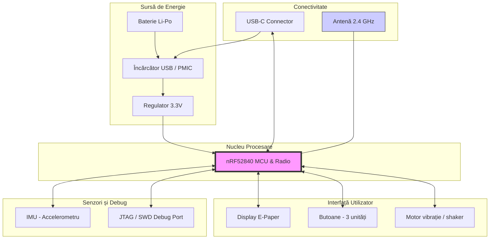

# Inktime

# 1. Funcționalitatea Hardware

Proiectul se bazează pe microcontroller-ul **nRF52840** (Nordic Semiconductor), un **SoC de înaltă performanță, ultra-low power**, cu nucleu **ARM Cortex-M4** și **FPU**, optimizat pentru aplicații wireless.

---

## Module și componente principale

### Microcontroller
- **nRF52840**  
  Gestionează procesarea datelor și comunicația wireless:
  - Bluetooth
  - Thread
  - Zigbee

### Oscilator cristal (XTAL)
- **NORDIC_NRF_1_XTAL_3215_N (32.768 kHz)**  
  Asigură precizia ceasului pentru **RTC** și optimizează consumul în modul **sleep**.

### Componente pasive
- Rezistențe și condensatori de decuplare (**0201 / 0402**)

Acestea sunt cruciale pentru:
- filtrarea zgomotului pe liniile de alimentare **VDD / VDDH**
- menținerea integrității semnalului

---

## Comunicație și procesare

### Interfețe digitale
- **I2C** – magistrală dedicată pentru senzori
- **GPIO** – controlul dispozitivelor auxiliare

---

## Consum de energie

Sistemul utilizează regulatorul **buck DC/DC integrat** în nRF52840.

Eficiența energetică este susținută de utilizarea oscilatorului extern de **32.768 kHz**, care permite o tranziție rapidă și precisă între stările de consum.

---

# 2. Alocarea pinilor nRF52840

Alocarea pinilor este realizată conform cerințelor de design identificate în schema **SchematicTSC.pdf**.

| Componentă | Pin nRF52840 | Descriere / Motivație |
|---|---|---|
| XTAL 32.768 kHz | P0.00 / P0.01 | Pini de intrare/ieșire pentru oscilatorul de joasă frecvență |
| I2C Interface (SDA) | P0.27 | Linie de date serială pentru comunicarea cu senzori |
| I2C Interface (SCL) | P0.26 | Linie de ceas serială pentru comunicarea cu senzori |
| Alimentare (VDD) | VDD | Nodul principal de alimentare a blocului logic |

---
# Diagramă bloc hardware

https://www.snapeda.com/search/?q=XFL4020&search-type=parts - XFL4020
https://www.snapeda.com/search/?q=SI1308EDL-T1-GE3&search-type=parts - SI1308EDL-T1-GE3
https://www.snapeda.com/search/?q=MBR0530&search-type=parts - MBR0530
https://www.snapeda.com/search/?q=MBR0530&search-type=parts - MBR0530
https://www.snapeda.com/search/?q=MBR0530&search-type=parts - MBR0530
https://www.snapeda.com/search/?q=DISCRETESEMI_SOT23-3&search-type=parts - DISCRETESEMI_SOT23-3
https://www.snapeda.com/search/?q=ESP32_C6&search-type=parts - ESP32_C6
https://www.snapeda.com/search/?q=HECTOR_WATCH_1_TPTP20R&search-type=parts - HECTOR_WATCH_1_TPTP20R
https://www.snapeda.com/search/?q=HECTOR_WATCH_1_TPTP20R&search-type=parts - HECTOR_WATCH_1_TPTP20R
https://www.snapeda.com/search/?q=MAX17048G%2BT10&search-type=parts - MAX17048G+T10
https://www.snapeda.com/search/?q=BQ25180YBGR&search-type=parts - BQ25180YBGR

https://www.snapeda.com/search/?q=USBLC6-2SC6Y&search-type=parts - USBLC6-2SC6Y
https://componentsearchengine.com/part-view/TC2030-IDC/Tag%20Connect - TC2030-IDC
https://www.snapeda.com/search/?q=HECTOR_WATCH_1_TPTP20R&search-type=parts - HECTOR_WATCH_1_TPTP20R *12 bucati
https://www.snapeda.com/search/?q=RT6160AWSC&search-type=parts - RT6160AWSC
https://www.snapeda.com/search/?q=MLP2016SR47MT0S1&search-type=parts - MLP2016SR47MT0S1
https://www.snapeda.com/search/?q=DRV2605YZFR&search-type=parts - DRV2605YZFR

https://componentsearchengine.com/search?term=2450AT18B100E - 2450AT18B100E
https://componentsearchengine.com/search?term=0805-WIDE - 0805-WIDE
https://componentsearchengine.com/search?term=NRF52840_QF - NRF52840_QF
https://www.snapeda.com/search/?q=NORDIC_NRF_BT-XTAL_2016_N&search-type=parts - NORDIC_NRF_BT-XTAL_2016_N
https://www.3dcontentcentral.com/download-model.aspx?catalogid=171&id=701860 - CRYSTAL-SMD-2.0X1.6MM
https://componentsearchengine.com/search?term=0805-WIDE - 0805-WIDE
https://componentsearchengine.com/search?term=0805-WIDE - 0805-WIDE

